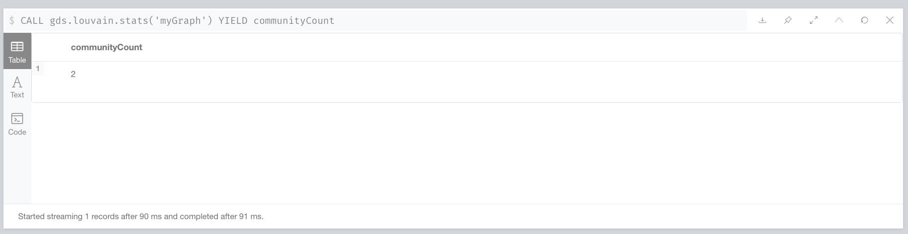

# neo4j

## 导入数据

```
CREATE
	(nAlice:User {name: 'Alice', seed: 42}),
	(nBridget: User {name: 'Bridget', seed: 42}),
	(nCharles: User {name: 'Charles', seed: 42}),
	(nDoug: User {name: 'Doug'}),
	(nMark: User {name: 'Mark'}),
	(nMichael: User {name: 'Michael'}),
	(nAlice)-[:LINK {weight: 1}]->(nBridget),
	(nAlice)-[:LINK {weight: 1}]->(nCharles),
	(nCharles)-[:LINK {weight: 1}]->(nBridget),
	(nAlice)-[:LINK {weight: 5}]->(nDoug),
	(nMark)-[:LINK {weight: 1}]->(nDoug),
	(nMark)-[:LINK {weight: 1}]->(nMichael),
	(nMichael)-[:LINK {weight: 1}]->(nMark);
```


## 验证导入数据

```
match (u:User) return *
```


## 准备工作

```
CALL gds.graph.create(
    'myGraph',
    'User',
    {
        LINK: {
            orientation: 'UNDIRECTED'
        }
    },
    {
        nodeProperties: 'seed',
        relationshipProperties: 'weight'
    }
)
```

## 评估算法所需资源

```
CALL gds.louvain.write.estimate('myGraph', { writeProperty: 'community' })
YIELD nodeCount, relationshipCount, bytesMin, bytesMax, requiredMemory
```


## 运行louvain算法

### 返回流结果

```
CALL gds.louvain.stream('myGraph')
YIELD nodeId, communityId, intermediateCommunityIds
RETURN gds.util.asNode(nodeId).name AS name, communityId, intermediateCommunityIds
ORDER BY name ASC
```


### 返回社区数

```
CALL gds.louvain.stats('myGraph')
YIELD communityCount
```



### 返回模块度

```
CALL gds.louvain.mutate('myGraph', { mutateProperty: 'communityId' })
YIELD communityCount, modularity, modularities
```

